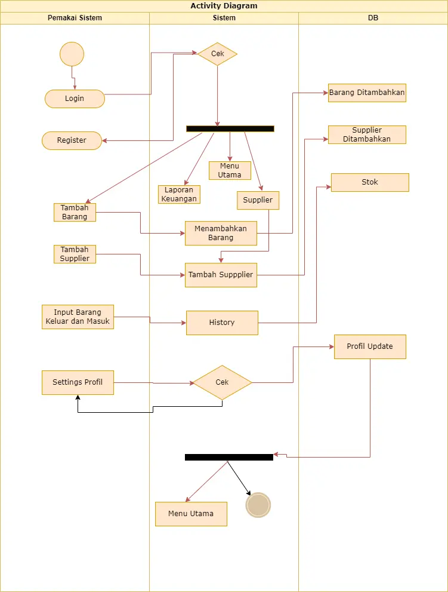
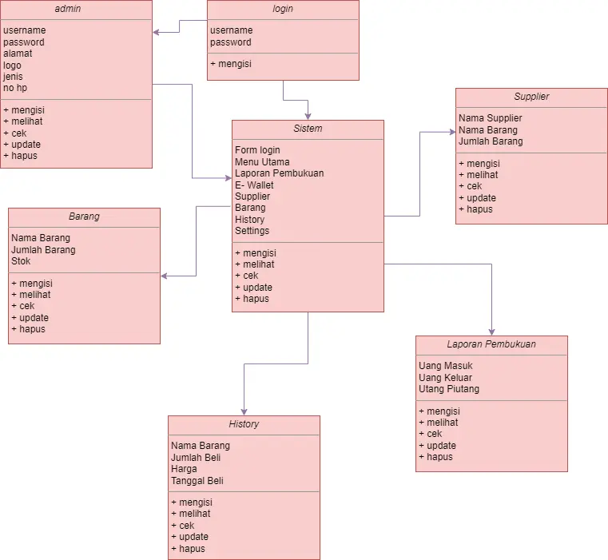
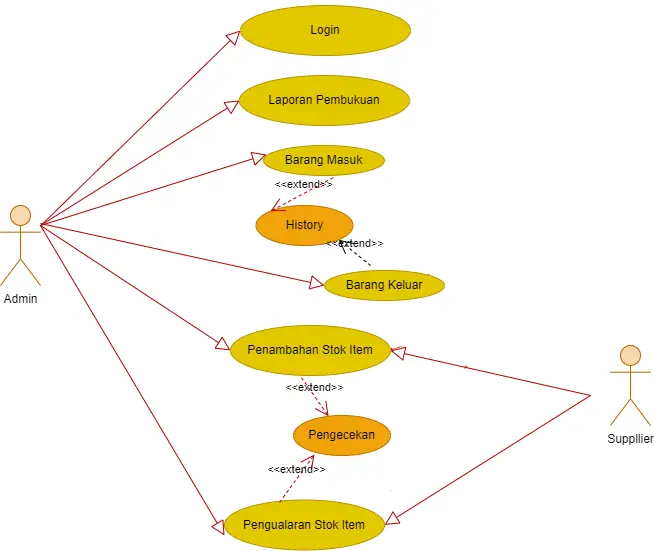
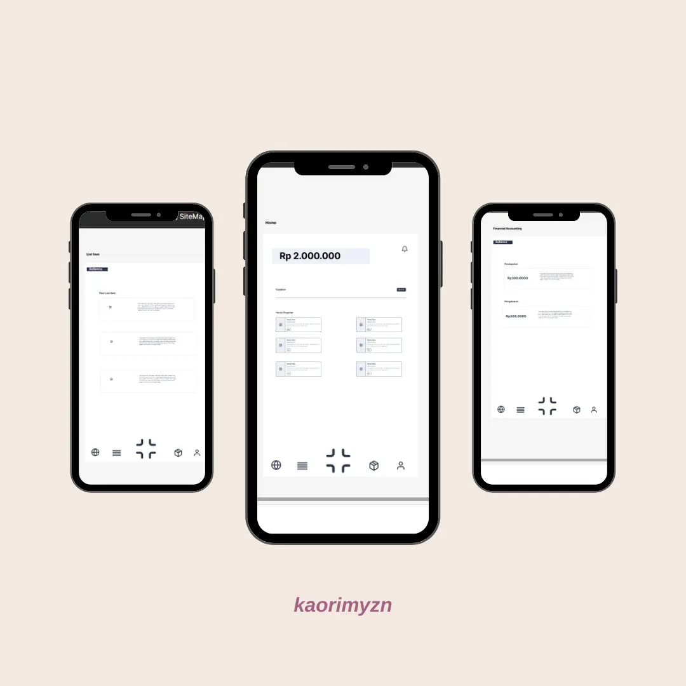
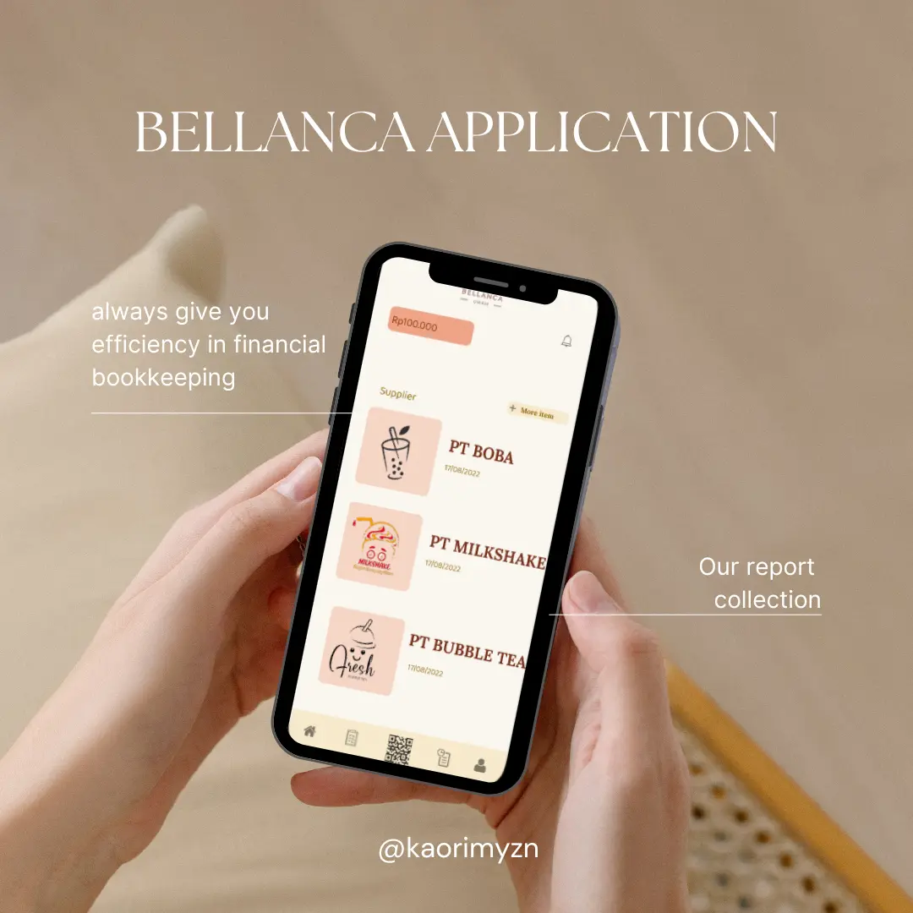

# Design

Aplikasi pembukuan keuangan UMKM akan dibangun menggunakan arsitektur standar, dengan front-end client, backend server, dan database. Klien front-end akan diimplementasikan menggunakan HTML, CSS, dan JavaScript, dan akan berkomunikasi dengan server backend menggunakan RESTful API. Server backend akan diimplementasikan menggunakan PHP dan framework Laravel, dan akan menggunakan database MySQL untuk menyimpan laporan pembukuan dan data aplikasi lainnya.

# User interface design:

Antarmuka pengguna untuk aplikasi pembukuan keuangan UMKM ini sederhana, dengan fokus pada kemudahan penggunaan. Layar utama akan menampilkan saldo user, list supplier dan produk, dengan kemampuan memfilter dan mengurutkan laporan berdasarkan bulan sampai tahun. Setiap produk dan supplier akan memiliki nama produk, deskripsi, nama supplier, dan harga produk dan akan ditampilkan dalam tata letak seperti kartu. Pengguna akan dapat membuat, mengedit, dan menghapus produk dan supplier menggunakan input sederhana. Pengguna juga mampu membuat, mengedit, dan menghapus laporan pemasukan keuangan dan pengeluaran serta hutang piutang usaha.

## UML

## Wireframe

Gambar diatas merupakan wifeframe dari aplikasi pembukuan keuangan UMKM. Wifeframe ini berguna untuk gambaran awal yang akan ditampilkan pada aplikasi. 

## Mockups

Gambar diatas merupakan mockup atau desain final dari aplikasi pembukuan keuangan UMKM. Mockup ini bertujuan untuk mempermudah programmer dalam tahap pengkodingan alur dan function dari aplikasi.

# Demo
- [Mockup Pembukuan Keuangan UMKM](https://www.figma.com/file/wFfcgxi3dVqlnqV700rZn5/MOCKUPGIA?node-id=0%3A1&t=YMMJCBwFlULTCOWq-0)
- [WifeFrame](https://www.figma.com/file/0WjLSPbN2JeraiW7XZTWfA/Userflow%2C-SiteMap%2C-Wireframe_Agia?node-id=0%3A1&t=b9iFsNxs29xlfH8A-0)